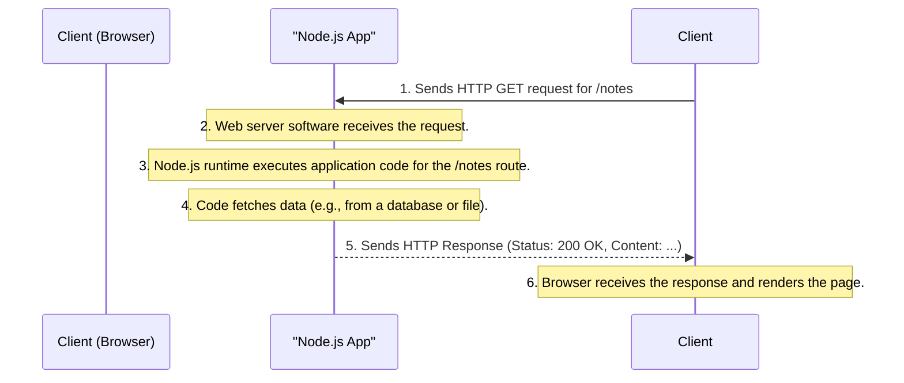
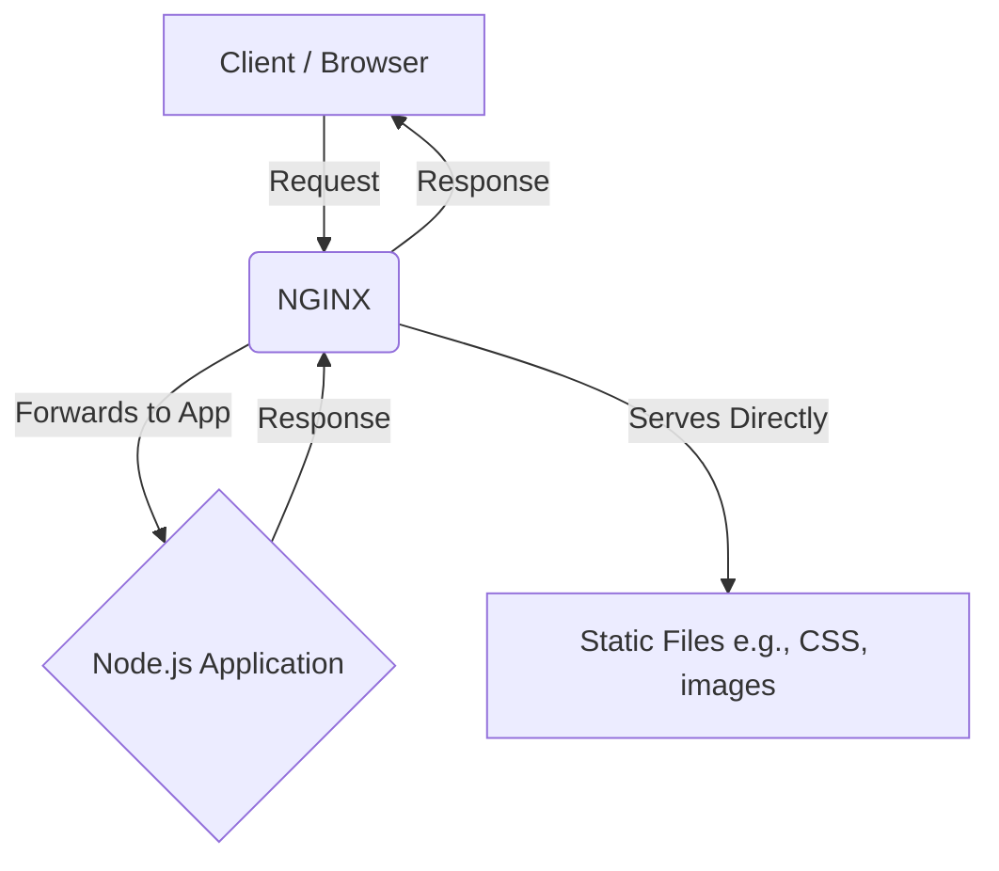
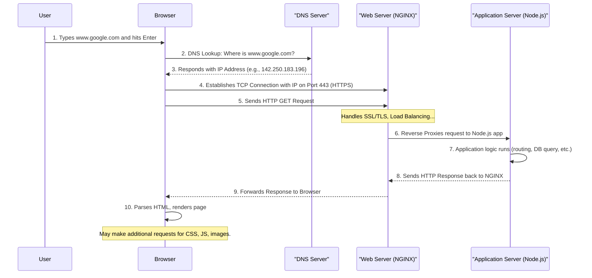
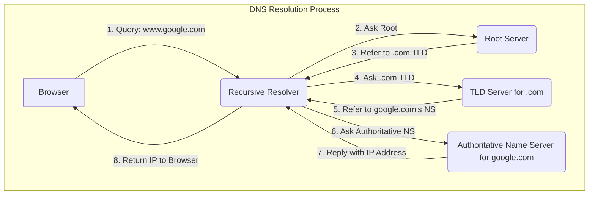
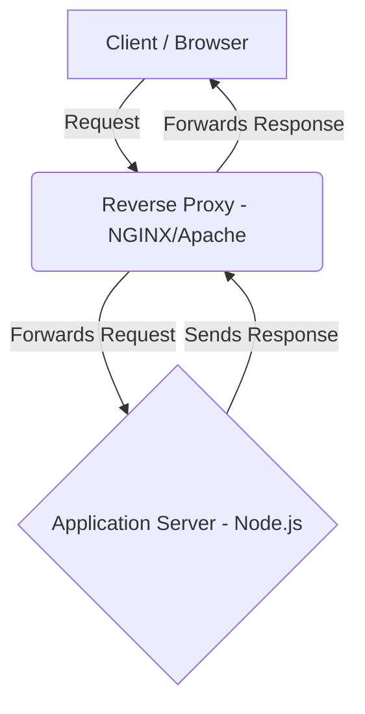
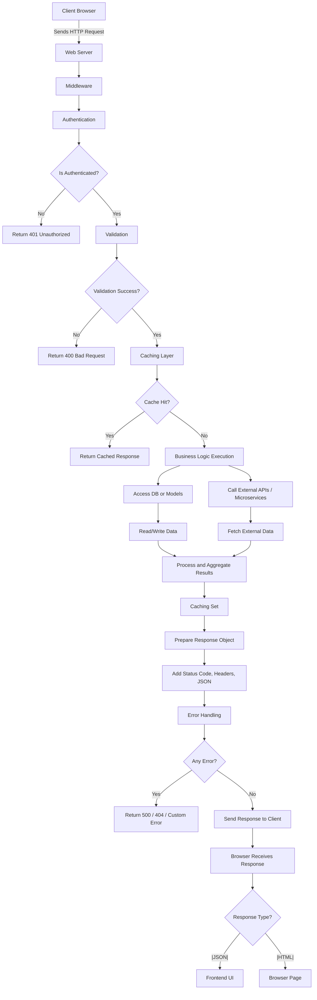

# A Beginner's Guide to How the Web Works: Browsers, Servers, and Everything in Between

This guide is designed to be a comprehensive, beginner-friendly explanation of how the internet works, from the moment you type a web address into your browser to the instant a webpage appears on your screen. We'll cover the roles of browsers and servers, how they communicate, and the underlying technologies that make it all possible.

This guide will use Mermaid.js to create diagrams and visualizations to help illustrate complex concepts.

*Ready to dive in? Let's get started!*

## Understanding HTTP: The Language of the Web

**HTTP (HyperText Transfer Protocol)** is the foundation of data communication for the World Wide Web. Think of it as the official language that web browsers (clients) and web servers use to talk to each other. It's a set of rules and standards that defines how messages are formatted and transmitted.

### Key Concepts:

*   **Protocol:** A protocol is simply a set of rules. In this case, HTTP is the rulebook for how a client should ask for information (a "request") and how a server should provide it (a "response").
*   **Stateless:** Each HTTP request is an independent event. The server doesn't remember anything about previous requests from the same client. This makes the system simpler but requires other mechanisms (like cookies or sessions) to manage user-specific information.
*   **Client & Server:**
    *   **Client:** The user's device making the request (e.g., your web browser, a mobile app, or a tool like Postman).
    *   **Server:** A powerful computer or system that stores the website's files, data, and application logic. It listens for requests and "serves" back the appropriate content.

### How is HTTP used in Node.js?

Node.js has a powerful, built-in core module called `http`. You don't need to install anything extra to use it. This module allows you to:

*   Create a web server from scratch.

*   Listen for incoming HTTP requests.

*   Craft and send back HTTP responses.

When you use frameworks like Express.js, they are actually using the Node.js `http` module under the hood, providing a friendlier, more organized way to handle web traffic.

## What is a Server, Really?

A server is more than just a powerful computer; it's a computer with a specific purpose: to **serve** content and services to clients over a network. Let's break down what a typical server contains.

### Server Components:

| Component             | Description                                                                                                 |
| --------------------- | ----------------------------------------------------------------------------------------------------------- |
| **Operating System**    | The foundation. Usually a specialized version of Linux (like Ubuntu Server) or Windows Server.                |
| **Web Server Software** | Listens for and manages incoming HTTP requests. Examples include Apache, Nginx, or the one you build in Node.js. |
| **Runtime Environment** | The engine that runs your code (e.g., Node.js, Python, Java).                                                 |
| **Application Code**    | This is your logic—the routes, database interactions, and features that make your application work.         |
| **Storage Layer**       | The file system where your files are stored, or a connected database (like MySQL, MongoDB) for structured data. |
| **Network Ports**       | Digital entry points for requests. Web traffic typically uses port 80 for HTTP and port 443 for HTTPS.      |
| **Security Layer**      | Firewalls to block malicious traffic and SSL/TLS certificates to enable secure HTTPS connections.            |

### How It All Works: A Step-by-Step Example

Imagine you type `https://example.com/notes` into your browser. Here’s a simplified flow of what happens:



### A Note on Security: HTTP vs. HTTPS

It's crucial to understand that **HTTP is not secure**. Data sent over HTTP is in plain text, meaning anyone snooping on the network can read it.

**HTTPS (HTTP Secure)** solves this by adding a layer of encryption (SSL/TLS). This ensures:

*   **Confidentiality:** The data cannot be read by third parties.
*   **Integrity:** The data cannot be modified in transit.
*   **Authentication:** You can be sure you are communicating with the correct server.

Always look for the padlock icon in your browser's address bar! That indicates a secure HTTPS connection.

## The Role of Web Server Software (Apache & NGINX)

While you can build a web server directly in Node.js, in a production environment, it's common to place a dedicated web server software *in front* of your Node.js application. The most popular choices are **Apache** and **NGINX**.

Think of them as the highly-efficient front desk or traffic controller for your application.

### Key Responsibilities:

*   **Accepting and Parsing Requests:** They are experts at listening for incoming HTTP requests on standard ports (like 80 for HTTP and 443 for HTTPS) and parsing them efficiently.
*   **Serving Static Files:** They are incredibly fast at serving static assets like HTML, CSS, images, and JavaScript files directly from the file system, without needing to bother your application code.
*   **Acting as a Reverse Proxy:** This is their most crucial role in a Node.js setup. The web server forwards the request to your Node.js application (which might be running on a different port, like 3000). It then waits for your application's response and sends it back to the client.
*   **Load Balancing:** If you have multiple instances of your application running, a web server can distribute incoming traffic among them, improving performance and reliability.
*   **Security and Caching:** They can handle tasks like SSL/TLS termination (for HTTPS), rate limiting to prevent abuse, and caching responses to reduce load on your application.

### Apache vs. NGINX: A Quick Comparison

| Feature        | Apache                               | NGINX (pronounced "Engine-X")          |
|----------------|--------------------------------------|----------------------------------------|
| **Architecture** | Process-based (creates a new process for each connection) | Event-driven and asynchronous (handles many connections in one process) |
| **Performance**  | Can be slower under very high traffic | Extremely fast, scalable, and memory-efficient. |
| **Common Use**   | Historically popular, good for shared hosting. | The modern standard for high-traffic sites and reverse proxies. |

**In a typical modern setup:**



## The Role of the Operating System (OS)

The Operating System is the foundational software that manages all the server's hardware and software resources. It's the silent, essential layer that makes everything else possible.

### Core Jobs of the OS on a Server:

*   **Hardware Management:** It controls the CPU (Central Processing Unit), RAM (Random-Access Memory), and disk storage, allocating these resources to the programs that need them.
*   **Process Management:** When you run your `node server.js` command, the OS creates a "process" for it, giving it memory and CPU time to execute.
*   **File System Management:** The OS provides the hierarchical file system (folders and files) that you use to store your application code, data, and logs. It handles all the reading and writing to the disk.

*   **Networking Stack:** This is critical. The OS manages the physical network hardware and provides the low-level networking stack (TCP/IP) that Node.js uses to create sockets, listen on ports, and send/receive data over the internet.

*   **Security:** It enforces user permissions (ensuring one program can't tamper with another) and provides tools like firewalls to control network network access.

So, the full hierarchy looks like this:

1.  **Hardware** (The physical machine)
2.  **Operating System** (e.g., Linux) runs on the hardware.
3.  **Node.js Runtime** runs as a process on the OS.
4.  **Your Application Code** runs inside the Node.js runtime.

## The Full Request-Response Lifecycle: From Browser to Server and Back

Now, let's tie everything together and trace the complete journey of a single request in a real-world, production-grade system.



### Step-by-Step Breakdown:

1.  **You Type the Address:** You enter a domain name like `www.google.com` into your browser.

2.  **DNS Resolution:** The browser first needs to translate this human-readable domain into a machine-readable IP address. It queries a **DNS (Domain Name System)** server, which acts like the internet's phonebook.

    *   **A Deeper Look at DNS Resolution:** The primary and sole purpose of DNS is to resolve a domain name to an IP address. However, this isn't a single step. It's a hierarchical process:
        1.  **Browser/OS Cache:** Your computer first checks its own cache to see if it already knows the IP address.
        2.  **Recursive Resolver:** If not cached, the request goes to a recursive resolver (often your Internet Service Provider). This resolver's job is to find the correct IP address by querying other DNS servers.
        3.  **Root Servers:** The resolver asks a root server, "Where can I find information about `.com` domains?"
        4.  **TLD Name Servers:** The root server directs the resolver to the Top-Level Domain (TLD) name server for `.com`. The resolver then asks the TLD server, "Where can I find the authoritative server for `google.com`?"
        5.  **Authoritative Name Server:** Finally, the resolver queries the authoritative name server for `google.com`. This is the ultimate source of truth for the domain, and it provides the final IP address.
        6.  **Back to the Browser:** The resolver sends this IP address back to your browser, which caches it for future use.



3.  **TCP Connection:** Once the browser has the IP address, it establishes a **TCP (Transmission Control Protocol)** connection with the server at that IP. For secure sites (HTTPS), this happens over port 443. This connection, often called a "three-way handshake," ensures that data packets can be sent and received reliably.

    *   **The TCP 3-Way Handshake:** Before any HTTP data can be sent, a reliable connection must be opened. This is the job of TCP.

    ```mermaid
    sequenceDiagram
        participant Browser
        participant Server

        Browser->>Server: 1. SYN (I want to connect)
        Server-->>Browser: 2. SYN-ACK (I hear you and I agree)
        Browser->>Server: 3. ACK (Connection established)
    ```
    This handshake ensures both the client and server are ready to communicate, guaranteeing that data won't be lost.

4.  **The HTTP Request:** The browser sends the actual HTTP request over the established connection. It includes the method (`GET`), the path (`/`), headers, and other information.

    *   **Dissecting the HTTP Request:** An HTTP request is a structured text message with several key parts:

        *   **Request Line:** The first line, containing:
            *   **HTTP Method:** The action to be performed (e.g., `GET`, `POST`, `PUT`, `PATCH`, `DELETE`).
            *   **Request Target/Path:** The specific resource on the server the request is for (e.g., `/api/users/123`).
            *   **HTTP Version:** (e.g., `HTTP/1.1`).

        *   **Headers:** Key-value pairs that provide metadata about the request. Common headers include:
            *   `Host`: The domain name of the server.
            *   `User-Agent`: Information about the browser making the request.
            *   `Accept`: What content types the browser can accept in the response (e.g., `application/json`).
            *   `Content-Type`: The format of the data in the request body (e.g., `application/json`).
            *   `Authorization`: Carries credentials for authenticating the user (e.g., `Bearer <token>`).

        *   **Request Body:** The actual data being sent to the server, used with methods like `POST`, `PUT`, and `PATCH`. The format of the body is specified by the `Content-Type` header.

    *   **Parameters:** Data can also be sent as parameters:
        *   **Query Parameters:** Key-value pairs at the end of a URL, following a `?` (e.g., `/search?query=Node.js`).
        *   **Route Parameters:** Dynamic segments within the URL path itself (e.g., the `123` in `/users/123`).

    *   **Cookies, CORS, and CSRF Tokens:**
        *   **Cookies:** Small pieces of data stored by the browser and sent back to the server with every request in the `Cookie` header. Used for session management.
        *   **CORS (Cross-Origin Resource Sharing):** A browser security feature. When a request is made from a different origin, the browser automatically adds an `Origin` header. The server must then respond with the correct `Access-Control-Allow-Origin` header to permit the request.
        *   **CSRF (Cross-Site Request Forgery) Tokens:** A security token generated by the server and sent back by the client in a header (e.g., `X-CSRF-Token`) or the request body to prevent malicious cross-site attacks.

### Step 5: The Web Server (Apache/NGINX) Intercepts the Request

You are correct, the request does not go directly to your application code. In a production environment, it's first handled by a dedicated web server software. This is a critical security and performance layer. Here’s what it does in depth:

1.  **Listens on a Port and Parses the Request:** The web server is always listening on a public port (80 for HTTP, 443 for HTTPS). Its first job is to read the raw request data—the method, path, headers, and body—to understand what the client wants.

2.  **Matches to a Virtual Host:** A single physical server can host multiple websites (e.g., `api.example.com` and `www.example.com`). The web server reads the `Host` header from the request to determine which site's configuration to use. This powerful feature is called **Virtual Hosting**.

3.  **Applies Rules and Directives:** Based on its configuration files (like `.htaccess` for Apache or `nginx.conf` for NGINX), the server applies predefined rules. These are powerful instructions that can:
    *   **Rewrite URLs:** Internally change a user-friendly URL (`/users/123`) to one the application understands (`/index.js?user_id=123`).
    *   **Enforce Security:** Block requests from malicious IP addresses or force all traffic to use HTTPS.
    *   **Set Headers:** Add or remove headers, such as those required for CORS (Cross-Origin Resource Sharing).

4.  **Determines Request Type: Static vs. Dynamic:** This is a crucial decision point.
    *   **Static Request:** A request for a file that doesn't change, like an image (`/images/logo.png`), a CSS file (`/css/styles.css`), or a plain HTML file. The web server handles this itself by reading the file from the disk and sending it directly to the browser. This is extremely fast and efficient.
    *   **Dynamic Request:** A request that requires running application code to generate a custom response. For example, `/api/login` (which needs to check a password) or `/products` (which needs to fetch data from a database). The web server knows it cannot handle this alone and must pass it to the backend application.

### Step 6: Forwarding to the Application Server (A Deep Dive into Reverse Proxy)

For dynamic requests, the web server acts as a **reverse proxy**. This is a fundamental concept in modern web architecture.

**What is a Reverse Proxy?**

A reverse proxy is a server that sits in front of one or more application servers, intercepting requests from clients. It acts on behalf of the application server. Instead of a client communicating directly with your Node.js application, it communicates with the reverse proxy. The reverse proxy then forwards the request to your application, receives the response, and sends that response back to the client.



**Why is this so important?**

Web servers like NGINX and Apache are highly optimized for handling raw web traffic and provide several critical benefits that a standard Node.js server doesn't handle out-of-the-box:

*   **Security:** It hides your application server's existence and IP address from the public internet. Attackers can only see the reverse proxy, which is hardened against common web attacks.
*   **Load Balancing:** If you have multiple application servers running for scalability, the reverse proxy can distribute incoming requests among them, preventing any single server from being overloaded.

*   **SSL Termination:** The reverse proxy can handle all the complex and CPU-intensive work of decrypting HTTPS requests and encrypting responses. Your application server can then deal with simple, unencrypted HTTP traffic internally, simplifying your code.
*   **Caching:** It can cache responses from your application. If another client requests the same resource, the reverse proxy can serve it from its cache without bothering your application, dramatically improving performance.
*   **Serving Static Content:** As mentioned before, the reverse proxy can serve static files directly, freeing up your application server to focus only on dynamic content.

In essence, the reverse proxy acts as a robust, secure, and efficient gateway to your application.

### Step 7: Application Logic - How the Node.js Server is Created and Listens

Your Node.js application receives the forwarded request from the reverse proxy. Now, your application code finally takes over. Let's break down exactly how the server process starts and handles the request.

**1. Creating a TCP-based HTTP Server Instance**

When you use `http.createServer()`, you are creating a server object that is fundamentally a **TCP listener that has been taught to speak the HTTP protocol.**

*   It doesn't create a new computer, but rather a specialized listener process within your Node.js application.
*   Its primary job is to wait for TCP connections, and once a connection is established, to parse the incoming data stream as an HTTP message.

**2. Listening on a Port with `server.listen()`**

After creating the server object, you must tell it where to listen. The `server.listen(3000)` command does two things:

*   **Binds to a Port:** It instructs the underlying Operating System to start directing any TCP traffic that arrives on the specified port (e.g., 3000) to this specific Node.js process.
*   **Starts the Event Loop:** It starts the server's event loop, which now actively listens for incoming connection attempts.

**3. The Connection and Request Lifecycle**

This is how the pieces fit together:

1.  A client (or a reverse proxy) initiates a TCP 3-way handshake with your server on the port it's listening on.
2.  The running Node.js server accepts this TCP connection.
3.  The client then sends the HTTP request data over this established connection.
4.  The Node.js `http` module parses this incoming data stream. It creates two critical JavaScript objects for you:
    *   **The `request` (req) object:** A readable stream containing all the parsed request data: `req.url`, `req.method`, `req.headers`, etc.
    *   **The `response` (res) object:** A writable stream that you will use to build and send your response back to the client.
5.  The server object then triggers a `'request'` event, executing the callback function you provided to `http.createServer()` and passing it the `req` and `res` objects.

**This callback function is the entry point into your application's logic for every single request.** From here, you have everything you need to decide how to respond.

### Step 8.2: Routing - Deciding Who Handles the Request

Now that the request is parsed and we have clean JavaScript data, the server needs to decide which block of code should be executed. This is **routing**.

Routing is the process of matching the incoming request's **HTTP method** (e.g., `GET`) and **URL path** (e.g., `/users`) to a specific handler function that is responsible for generating a response.

**1. Routing in Vanilla Node.js**

Without a framework, you have to implement the routing logic yourself. This is typically done with a series of `if/else if` statements or a `switch` statement.

```javascript
const http = require('http');

const server = http.createServer((req, res) => {
  const { method, url } = req;

  if (method === 'GET' && url === '/') {
    res.end('Welcome to the homepage!');
  } else if (method === 'GET' && url === '/users') {
    // Logic to get all users...
    res.end('Here are all the users.');
  } else {
    // Handle 404 Not Found
    res.writeHead(404, { 'Content-Type': 'text/plain' });
    res.end('Error: Page Not Found');
  }
});

server.listen(3000);
```

As you can see, this can become very complex and hard to maintain as your application grows.

**2. How Frameworks Like Express.js Handle Routing**

Frameworks provide a clean, powerful, and declarative way to define routes. In Express, you define routes that directly map a method and a path to a handler function.

```javascript
const express = require('express');
const app = express();

// Route for GET requests to the root URL ('/')
app.get('/', (req, res) => {
  res.send('Welcome to the homepage!');
});

// Route for GET requests to '/users'
app.get('/users', (req, res) => {
  // Logic to get all users...
  res.send('Here are all the users.');
});

// Route for POST requests to '/users'
app.post('/users', (req, res) => {
  // Logic to create a new user...
  res.end('New user created.');
});

// Express handles 404s automatically if no route matches

app.listen(3000);
```

**Dynamic Routes with Parameters**

Frameworks also make it easy to handle dynamic parts of a URL. For example, to get a user by their ID (`/users/123`), you can define a route parameter with a colon (`:`).

```javascript
app.get('/users/:userId', (req, res) => {
  // Express parses the userId from the URL and puts it in req.params
  const { userId } = req.params; // For /users/123, userId will be '123'
  res.send(`Fetching details for user #${userId}`);
});
```

This routing mechanism is the backbone of any web application, directing traffic to the correct logic controllers.

### Step 8.3: Middleware Execution - The Application's Gatekeepers

Before the main route handler logic is executed, the request must first pass through a chain of **middleware** functions. Think of middleware as a series of security guards or checkpoints. Each one inspects the request and can decide to either pass it to the next guard in line or reject it immediately.

In frameworks like Express, a middleware is simply a function that has access to the `request` object (`req`), the `response` object (`res`), and a special function called `next`.

*   It can perform any operation (e.g., check for a token, log data).
*   It can end the request-response cycle if needed (e.g., by sending an error response).
*   Or, it can call `next()` to pass control to the next middleware in the stack.

Here are the most common tasks handled by middleware, just as you described:

**1. Authentication**

This middleware checks: *"Is this user logged in?"* It typically looks for a token in the `Authorization` header.

```javascript
const checkAuth = (req, res, next) => {
  const token = req.headers.authorization;
  if (!token) {
    return res.status(401).send('Error: No authentication token provided.');
  }
  // Logic to verify the token...
  // If valid, attach user data to the request for later use
  req.user = { id: '123', name: 'Altamash' };
  next(); // Token is valid, proceed to the next middleware
};
```

**2. Authorization**

This middleware runs *after* authentication and asks: *"Is this logged-in user allowed to do this?"*

```javascript
const isAdmin = (req, res, next) => {
  // Assumes the checkAuth middleware has already run and attached req.user
  if (req.user.role !== 'admin') {
    return res.status(403).send('Error: You do not have permission to perform this action.');
  }
  next(); // User is an admin, proceed.
};

// This route would only be accessible to admins
app.delete('/users/:id', checkAuth, isAdmin, (req, res) => {
  // ... logic to delete a user
});
```

**3. Logging**

This middleware logs information about every incoming request for debugging and monitoring.

```javascript
const logger = (req, res, next) => {
  console.log(`[${new Date().toISOString()}] ${req.method} ${req.url}`);
  next(); // Always pass control to the next handler
};

app.use(logger); // app.use() applies this middleware to all requests
```

**4. Rate Limiting**

This protects your server from abuse by limiting how many requests a single user can make in a certain amount of time.

```javascript
const rateLimit = require('express-rate-limit');

const apiLimiter = rateLimit({
  windowMs: 15 * 60 * 1000, // 15 minutes
  max: 100, // Limit each IP to 100 requests per window
  standardHeaders: true,
  legacyHeaders: false,
});

app.use('/api/', apiLimiter); // Apply this limiter only to API routes
```

This middleware pipeline is what makes frameworks so powerful, allowing you to create reusable, composable logic that keeps your route handlers clean and focused on their specific task.

### Step 8.4: Authentication & Authorization

Among the most important middleware tasks are Authentication and Authorization. Although they sound similar, they have distinct and critical roles.

**1. Authentication (AuthN): Verifying Identity**

Authentication answers the question: **"Who is this user?"**

It's the process of verifying that users are who they claim to be. The most common way this is handled in modern APIs is with **JSON Web Tokens (JWT)**.

*   **The Flow:**
    1.  A user logs in with their credentials (e.g., email and password).
    2.  The server validates these credentials. If they are correct, it generates a signed JWT. This token contains a payload with user information (like their ID).
    3.  The server sends this token back to the client.
    4.  The client stores this token (preferably in a secure `HttpOnly` cookie) and sends it back to the server with every subsequent request, typically in the `Authorization: Bearer <token>` header.
    5.  An authentication middleware on the server then verifies the token on every request to a protected route. If the token is valid, the user is "authenticated."

**2. Authorization (AuthZ): Verifying Permissions**

Authorization comes *after* a user has been successfully authenticated. It answers the question: **"Is this authenticated user allowed to do this specific thing?"**

This is often based on roles or permissions.

*   **The Flow:**
    1.  A request comes in for a specific action (e.g., `DELETE /api/users/456`).
    2.  The authentication middleware runs first and confirms the user is valid (e.g., it's User `123`).
    3.  Next, an authorization middleware runs. It checks the permissions associated with User `123`. The JWT payload often contains the user's role (e.g., `role: 'subscriber'`).
    4.  The middleware checks if the `subscriber` role is allowed to perform the `DELETE` action on the `/users` route. In this case, it likely isn't.
    5.  The middleware rejects the request with a `403 Forbidden` status, even though the user was perfectly authenticated.

In summary:

*   **Authentication** lets a user into the building.
*   **Authorization** decides which rooms inside the building they are allowed to enter.

### Step 8.5: Input Validation and Sanitization

Just because a user is authenticated and authorized doesn't mean the data they send is valid or safe. This step is a critical security measure that answers the question: **"Is the data provided by the user in the correct format and safe to use?"**

Never trust client-side input. It must always be validated on the server.

**1. What is Input Validation?**

Validation is the process of enforcing rules on incoming data. If the data doesn't conform to the rules, the request is rejected, typically with a `400 Bad Request` status code. This prevents malformed or incorrect data from reaching your core business logic and database.

Common validation rules include:

*   **Type Checking:** Is the `age` a number? Is `isAdmin` a boolean?
*   **Format Checking:** Is the `email` a valid email address format?

*   **Range/Length Checking:** Is the `password` at least 8 characters long? Is the `username` no more than 20 characters?
*   **Presence Checking:** Is the `email` field present, or is it missing?

**2. What is Sanitization?**

Sanitization is the process of cleaning the input to remove or escape potentially dangerous characters. This is a key defense against cross-site scripting (XSS) attacks, where an attacker might try to inject malicious HTML or JavaScript into your data.

**3. How it's Done (with Libraries like Zod)**

While you could write validation logic manually with `if` statements, it's tedious and error-prone. Libraries like **Zod** or **Joi** provide a declarative and powerful way to define schemas for your data.

Here's an example of how you would validate a user signup form in an Express route handler using Zod:

```javascript
const { z } = require('zod');

// Define the schema for the expected request body
const signupSchema = z.object({
  email: z.string().email({ message: "Invalid email address" }),
  username: z.string().min(3, "Username must be at least 3 characters long"),
  password: z.string().min(8, "Password must be at least 8 characters long"),
});

app.post('/signup', (req, res) => {
  // 1. Validate the incoming request body against the schema
  const validationResult = signupSchema.safeParse(req.body);

  // 2. Check if validation failed
  if (!validationResult.success) {
    // If it failed, send a 400 error with the details
    return res.status(400).json({ errors: validationResult.error.issues });
  }

  // 3. If validation passed, you can now safely use the data
  const { email, username, password } = validationResult.data;

  // ... proceed with user creation logic ...
});
```

By validating input, you ensure that your core business logic only ever operates on data that is clean, safe, and in the format you expect.

### Step 8.6: The Caching Layer

As you correctly pointed out, before executing expensive business logic (like a database query or a third-party API call), a smart server checks a **cache** first. Caching is the process of storing the results of expensive operations and reusing them for subsequent, similar requests.

**The Flow:**

1.  When a request comes in for data (e.g., a user's profile), the server first generates a unique cache key (e.g., `user:123:profile`).
2.  It checks a high-speed data store, like **Redis**, to see if a value for this key already exists.
3.  **Cache Hit:** If the data is found in the cache, the server returns it immediately, skipping the business logic and database query entirely. This is extremely fast.
4.  **Cache Miss:** If the data is not in the cache, the server proceeds to execute the business logic (e.g., querying the database). Once it retrieves the data, it stores the result in the cache with an expiration time (TTL - Time To Live) before returning it to the user. The next request for the same data will then be a cache hit.

**Example with Redis:**

```javascript
// Assumes you have a redisClient configured

app.get('/users/:id/profile', async (req, res) => {
  const { id } = req.params;
  const cacheKey = `user:${id}:profile`;

  // 1. Check the cache first
  const cachedProfile = await redisClient.get(cachedKey);

  if (cachedProfile) {
    // 2. Cache Hit: Return the cached data
    return res.json(JSON.parse(cachedProfile));
  }

  // 3. Cache Miss: Execute the business logic
  const userProfile = await db.users.fetchProfile(id);

  // 4. Store the result in the cache for next time (e.g., for 10 minutes)
  await redisClient.setEx(cacheKey, 600, JSON.stringify(userProfile));

  // 5. Return the fresh data
  res.json(userProfile);
});
```

By implementing a caching layer, you can dramatically reduce latency, decrease the load on your database, and lower costs for third-party API calls.

### Step 8.7: Business Logic Execution

If the requested data is not in the cache (a cache miss), the server proceeds to execute the **business logic**. This is the core of your application—it's where the actual work gets done.

This logic resides in your route handler (or in a more organized architecture, a "controller" or "service" layer). Its responsibility is to take the validated input and perform the required actions.

Examples of business logic include:

*   **Fetching Data:** If a user requests `GET /api/notes`, the business logic will query the database to retrieve all notes belonging to that user.
*   **Creating Data:** For a `POST /api/notes` request, the business logic will take the validated data from the request body and create a new note record in the database.
*   **Updating Data:** For a `PATCH /api/notes/123` request, it will update the content of note `123` in the database.
*   **Deleting Data:** For a `DELETE /api/notes/123` request, it will remove note `123` from the database.
*   **Complex Operations:** It can also involve more complex tasks like processing a payment, sending an email notification, or calling other APIs.

**Interaction with the Database**

As you correctly pointed out, this is almost always where the server interacts with the database. The business logic constructs and executes database queries to Create, Read, Update, and Delete (CRUD) data.

```javascript
// Example of business logic inside an Express route handler
app.post('/notes', isAuthenticated, (req, res) => {
  // Input validation would have already happened (e.g., in a middleware)
  const { title, content } = req.body;
  const userId = req.user.id; // Attached by the authentication middleware

  // --- Start of Business Logic ---
  try {
    // 1. Interact with the database to create a new note
    const newNote = db.notes.create({
      ownerId: userId,
      title: title,
      content: content,
    });

    // 2. Send a success response
    res.status(201).json({ message: 'Note created successfully', note: newNote });
  } catch (error) {
    // 3. Handle any potential database errors
    res.status(500).json({ message: 'Failed to create note.' });
  }
  // --- End of Business Logic ---
});
```

This layer is what makes your application unique and provides value to your users.

### Step 8.8: Third-Party API and Microservice Calls

Often, your server's business logic will need to communicate with other services to complete a task. These are called **service calls**.

There are two main types:

1.  **Third-Party API Calls:** Your server communicates with an external service over the internet (e.g., calling the Stripe API to process a payment, the OpenAI API to generate text, or a weather API to get forecast data).
2.  **Internal Microservice Calls:** In a microservices architecture, your application is broken down into smaller, independent services. One service (e.g., an `Order Service`) might need to call another (e.g., a `User Service`) to get user details.

**How It's Structured**

To keep the code clean and reusable, these calls are typically abstracted into a `services` directory.

Here is an example of a service that calls an external weather API using the popular `axios` library:

```javascript
// services/weatherService.js
const axios = require('axios');

async function getWeatherData(city) {
  try {
    const response = await axios.get(`https://api.weatherapi.com/v1/current.json`, {
      params: {
        key: process.env.WEATHER_API_KEY, // API key stored securely
        q: city,
      },
    });
    return response.data;
  } catch (error) {
    // Log the error and throw a generic error to the caller
    console.error('Error fetching weather data:', error.message);
    throw new Error('Unable to fetch weather data at this time.');
  }
}

module.exports = { getWeatherData };
```

This service can then be easily used within any route handler:

```javascript
// routes/weather.js
const { getWeatherData } = require('../services/weatherService');

app.get('/weather', async (req, res) => {
  try {
    const { city } = req.query;
    const weatherData = await getWeatherData(city);
    res.json(weatherData);
  } catch (error) {
    res.status(500).json({ message: error.message });
  }
});
```

This separation of concerns makes the code much easier to test, maintain, and reason about.

### Step 8.9: Error Handling

Things will inevitably go wrong. A database might be down, a third-party API might fail, or a user might provide invalid data. Robust error handling is what separates a fragile application from a production-ready one. The goal is to gracefully catch any error, log it for debugging, and send a clear, appropriate response to the client without crashing the server.

**Where Errors Happen:**

*   **Validation:** Invalid user input (Status `400`).
*   **Authentication:** Missing or invalid token (Status `401`).
*   **Authorization:** User lacks permissions (Status `403`).
*   **Resource Not Found:** Querying for a user that doesn't exist (Status `404`).
*   **Server-Side Issues:** A database connection fails or an unexpected code bug occurs (Status `500`).

**How It's Structured (in Express)**

Express uses a special type of middleware for error handling. It has four arguments (`err`, `req`, `res`, `next`) and is defined at the very end of your middleware stack.

```javascript
// In your route/service, you throw an error
if (!user) {
  const error = new Error('User not found.');
  error.statusCode = 404;
  throw error; // Or call next(error)
}

// In your main app.js file, at the end:
// Central Error-Handling Middleware
app.use((err, req, res, next) => {
  // Log the error for the developers
  console.error(err.stack);

  const status = err.statusCode || 500;
  const message = err.message || 'Something went wrong on the server.';

  // Send a clean, user-friendly response
  res.status(status).json({ success: false, message });
});
```

This centralizes all error logic into one place.

### Step 8.10: Prepare and Send the HTTP Response

After the business logic has run successfully (or an error has been gracefully handled), the final step is to prepare and send the HTTP response back to the client.

**1. What Format is the Response Sent In?**

As you asked, the format depends on the type of application:

*   **For modern APIs (most common):** The data is almost always sent as **JSON** (JavaScript Object Notation). It is lightweight, easy for JavaScript on the frontend to parse, and language-independent.
*   **For traditional Server-Side Rendered (SSR) applications:** The server would send back a full **HTML** document as a string.

For our guide, we will focus on the modern API approach of sending JSON.

**2. Constructing the Response**

A well-structured JSON response typically includes:

*   **Status Code:** Set with `res.status()`. This is a crucial signal to the client about the outcome (e.g., `200 OK`, `201 Created`, `404 Not Found`).
*   **Headers:** Set with `res.set()`. The most important is `Content-Type: application/json` which `res.json()` sets automatically.
*   **JSON Body:** The actual data payload. It's good practice to wrap your data in a consistent object structure.

```javascript
// Example of a successful response
res.status(200).json({
  success: true,
  message: "User data fetched successfully.",
  data: { userId: 123, name: "Altamash" }
});

// Example of an error response
res.status(404).json({
  success: false,
  message: "User with that ID was not found.",
  data: null
});
```

**3. What Happens After the Response is Sent?**

1.  The response travels from your Node.js application back through the **reverse proxy** (NGINX/Apache).
2.  The reverse proxy sends it over the internet back to the client's **browser**.
3.  The browser's JavaScript code that made the original request (e.g., using `fetch` or `axios`) receives the response.
4.  The JavaScript code then **parses the JSON data** into a JavaScript object.
5.  Finally, it **updates the UI** dynamically without a page reload. For example, it might render a list of products, show a "Login Successful" message, or redirect the user to their dashboard.

This completes the entire request-response lifecycle.

## The Complete End-to-End Flow: A Visual Summary

Let's put everything we've learned together into a single, comprehensive diagram that visualizes the entire journey.



**How to Read the Diagram**
1.	**Client (Browser)** sends a request.
2.	Request flows through **middleware layers**:
	*	Authentication
	*	Validation
3.	Then we check the **cache** (e.g., Redis):
	*	If data exists, return cached response.
4.	If not, execute **business logic**:
	*	Fetch/update DB
	*	Call APIs
5.	Then **prepare a structured response**:
	*	Add status code (e.g., 200, 201)
	*	Format as JSON/HTML
6.	Pass through **error-handling middleware**
7.	**Send response to client** → frontend renders it

And there you have it. From a simple click in a browser to a fully rendered page, you now have a deep and comprehensive understanding of how the modern web works. Congratulations!